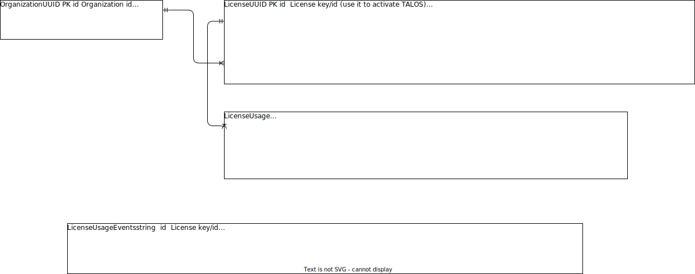

# Licensing microservice

## How to test

Only e2e test exist. To execute them use `test/e2e.sh`(test/e2e.sh)

## Database

Relational diagram: 




Columns have the following structure: Type, attributes, name, description

All tables but `LicenseUsageEvents` are proposed to be stored in a relational database (e.g. PostgreSQL).

- `License` table is not meant to be either write or read intensive. Licenses are added or queried not so frequently.

- `LicenseUsage` is meant to be read and write intensive (more less). It is expected that clients connect and "acquire a new lock" or disconnect and "release the lock" on the license very frequently.

- `Organization` table is not meant to be either write or read intensive. It is mostly informative, and it can even be deleted from the model.

- `LicenseUsageEvents` is meant to be write-intensive since it is going to store all events from all clients. Because of that it is proposed that this is a Mongo collection instead of a relational table.

With this licensing model, we’re going to be able to (just a few things):

- Prevent cracking (licenses are validated in backend, and there is a limit of concurrent clients. We could even add a 1-1 table mapping of client id and IP addresses to prevent session hijacking)

- Monitor who (which computer) uses the licenses. We could also restrict access to certain machines/IPs.

- Have more centralized and granular control of licenses (e.g. we'll now be able to revoke licenses at will)

- and more… (probably)

### Fixing the “dead client” problem

Why not simply acquiring the lock when TALOS is opened and releasing it when TALOS is closed?

Because you can’t trust the user. Think about what would happen if user sends SIGKILL to several TALOS instances, in such case the lock was acquired when TALOS was opened but it wasn’t released (because SIGKILL is handled by OS and not by TALOS). We will eventually run out of available connections for that specific client => +tickets opened, +support calls, +costs, +frustration, ...

This is actually a “bug” present in current versions of TALOS because each time a test case is edited a lock is acquired and if SIGKILL is sent... you now know what happens. (The only solution I found was to remove the lock by manually executing a database query)


### How to remove locks from “dead clients”

The most efficient solution I found is to check for dead clients (those who satisfy `now - last_ka_received_at >= client_timeout`) each time a new client tries to acquire the lock and remove them.

We could also add some cron job or something like that to act as a "garbage collector", but that may not be as efficient as the first proposal.

### Will this break the current TALOS version?

No. But it is very likely that, in order to support all of the features this microservice offers, some code changes need to be made. Examples:

- To validate and acquire a lock on the license, the server should be queried.

- It will be needed to send "keep active" messages to the server from time to time to prevent the lock from being released.

But they're somewhat easy to implement (if code is SOLID), for example:

- We could simply change the inner implementation of whichever interface is used to validate the license.

- To send keep active messages we could create another daemon thread to send these messages every `x` seconds.

## Security measures

Non-repudation is achieved by signing all request bodies with a private PGP key only known by TALOS client 
(public key is known by the microservice).
Ideally, the public key is symmetrically encrypted (with a good password, maybe one randomly selected at installation time) in
TALOS client to prevent anyone (but TALOS itself) from viewing the key.

To prevent replay attacks, body should contain a timestamp (property `ts`). Request should be dropped (rejected) if the server receives
it `x` seconds (30s) after the timestamp.

Request content type should be `text/plain`.

Example:

```json
...other HTTP headers...
Content-Type: text/plain
...other HTTP headers...


-----BEGIN PGP SIGNED MESSAGE-----
Hash: SHA256

{"ts":1682467383084,...remainingProperties}
-----BEGIN PGP SIGNATURE-----

iQEzBAEBCAAdFiEEwNExhwwk5Igv6yDwMrLeLLfshxEFAmRHR8EACgkQMrLeLLfs
hxFRDQf/WjRA9gcobS/wlWaobnidk9E54QO0cKlbXqrcVKGO1L8Pdt+lwXaxxMrr
B7GX+QmlJolKUt5Gb6mXvTgMQ9ME2zphkj6LKh0Zwn8Z0RerKBFPE7x5007sIg5a
5Aw6sgYLjtza8kJMiMSDHH3JxQK0R+hqCBFzqS4pzGRXUE+hyqf0cf/9SEU57cJo
N87JVPjFsbBBdcO2s44I+E49Hrakm4wxuwrUEUcTDvwlYhyvAJ41svMhZz6TAUKm
eXaJPaPKjO9hWAtgfh53Yl6SWJzp/WwMfcwcvAn/f4fYepIS7hoNBRXutyI7qtIv
kYY9HpdJQVB40mZ6bdJQAfMF8Q4Lnw==
=yYZ3
-----END PGP SIGNATURE-----
```
